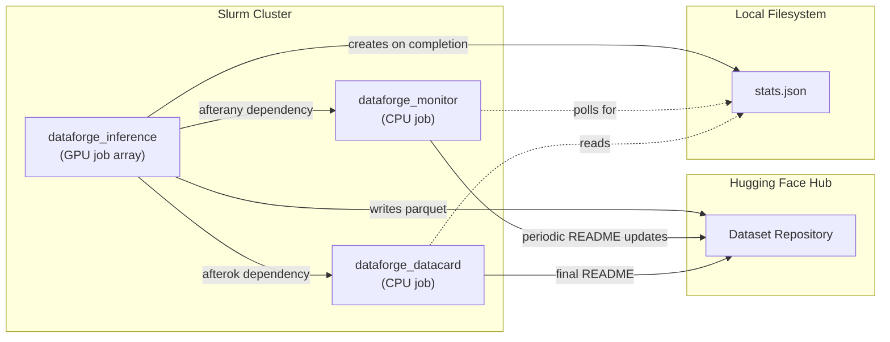

# DataForge

DataForge is a scalable, synthetic data generation framework built on [DataTrove](https://github.com/huggingface/datatrove) for creating high-quality training datasets with language models. DataForge supports both local execution and distributed processing on Slurm clusters with built-in chunking, checkpointing, and queue management.

## Installation

To run the code in this project, first create a Python virtual environment using e.g. `uv`:
```sh
uv venv .venv --python 3.11 && source .venv/bin/activate && uv pip install --upgrade pip
uv sync
```

Make sure to login to your HF account with `hf auth login` using a token with write access since the script creates dataset repos and uploads data.

## Quickstart

DataForge provides two main execution modes for generating synthetic training data from existing datasets:

* **Local execution**: Run on a single machine with multiple workers for development and small-scale generation
* **Slurm cluster**: Distribute processing across multiple nodes for large-scale production workloads

The framework reads input datasets from Hugging Face Hub, processes them through a specified language model (supported via the vLLM backend so far), and outputs the generated synthetic data back to Hugging Face Hub with automatic chunking and checkpoint recovery.

### Generate synthetic data locally

For development or small-scale generation, use the `--local-execution` argument to generate data on a single GPU:

```sh
python dataforge/generate_data.py \
    --input-dataset-name simplescaling/s1K-1.1 \
    --input-dataset-split train \
    --prompt-column question \
    --model-name-or-path Qwen/Qwen3-4B-Thinking-2507 \
    --output-dataset-name s1K-1.1-dataforge \
    --output-dir data \
    --tasks 1 \
    --examples-per-chunk 50 \
    --local-execution
```

Use the `--dp` and `--tp` flags to configure data and tensor parallelism for multi-GPU setups. For example, to run with 2-way tensor parallelism on 2 GPUs, set `--tp 2 --dp 1`.

For multi-node setups, usually you want to set `--tp {NUM_GPUS_PER_NODE}` and then `--pp 2` and `--nodes-per-task 2` to fit a model on 2 nodes.


### Slurm Job Architecture

When running on Slurm, DataForge automatically manages three separate jobs with inter-dependencies to ensure efficient processing and accurate reporting:



1.  **`dataforge_inference`** (GPU array job): The main execution job that processes data in parallel using vLLM. It writes Parquet shards directly to the Hugging Face Hub. Upon successful completion of all tasks, it generates a `stats.json` file.
2.  **`dataforge_monitor`** (CPU job): A lightweight job that periodically polls the repository for progress and updates the dataset card (README.md) with a live progress bar and ETA. It has an `afterany` dependency on the inference job, meaning it will stop automatically when the inference job finishes (either successfully or with a failure).
3.  **`dataforge_datacard`** (CPU job): This job runs only after the successful completion of the inference job (`afterok` dependency). it reads the final `stats.json` and generates the final, comprehensive dataset card with detailed token statistics.

### Generate synthetic data on a Slurm cluster

For large-scale production workloads, distribute the processing across multiple nodes using Slurm:

```sh
python dataforge/generate_data.py \
    --input-dataset-name simplescaling/s1K-1.1 \
    --input-dataset-split train \
    --prompt-column question \
    --model-name-or-path Qwen/Qwen3-4B-Thinking-2507 \
    --output-dataset-name s1K-1.1-dataforge \
    --output-dir data \
    --num-workers 10 \
    --tasks 20 \
    --examples-per-chunk 50
```

The script will automatically handle chunking, checkpointing, and queue management for you. The `--tasks` flag controls the size of the Slurm array, while `--num-workers` specifies the number of jobs that can run concurrently.

## Input data format

By specifying `--prompt-column`, the script reads that column from the Hugging Face dataset as the input text for each example. Only the prompt column is consumed. Any existing target/label/completion columns are ignored by this script, but you can keep them for evaluation.
It then builds a chat-style request by prepending an optional `--system-prompt` and either using preformatted message lists when present or wrapping the text as a single user message.

Optionally, you can specify `--prompt-template` to define a template that wraps the content from the prompt column. Use the variable `[[DOCUMENT]]` in your template, which will be replaced with the text from the specified column.

### Supported prompt column formats

Set `--prompt-column` to a column that contains one of the following:

- Plain string (single-turn prompt)

  Example dataset row if you use `--prompt-column question`:

  ```json
  {"question": "What color is the sky?"}
  ```

  The request sent to the model becomes:
  - optional system message from `--system-prompt` (if provided)
  - user: the string from `question`

- Plain string with template (single-turn prompt with custom formatting)

  Use `--prompt-template` to wrap the column content in a template. The `[[DOCUMENT]]` variable will be replaced with the text from the specified column.

  Example dataset row from WikiText:

  ```json
  {"text": "The sky appears blue during the day due to Rayleigh scattering..."}
  ```

  The request sent to the model becomes:
  - optional system message from `--system-prompt` (if provided)
  - user: "Summarize the following document: The sky appears blue during the day due to Rayleigh scattering..."

- Messages list (multi-turn chat)

  Provide a list of `{role, content}` objects and set `--prompt-column` to that column (e.g. `messages`). A system message from `--system-prompt` (if provided) is automatically prepended.

  Single-turn:
  ```json
  {"messages": [{"role": "user", "content": "What color is the sky?"}]}
  ```

  Multi-turn:
  ```json
  {
    "messages": [
      {"role": "user", "content": "Hi"},
      {"role": "assistant", "content": "Hello! How can I help?"},
      {"role": "user", "content": "What color is the sky?"}
    ]
  }
  ```

## Model Lineup

We have benchmarked DataForge with a variety of models to determine the best throughput and number of GPUs required to generate 1 billion tokens per hour. The following table provides an overview of these optimised configurations:


| Model name                                                                                                      | Architecture | Size      | TP | PP | Input TPS/GPU | Output TPS/GPU | GPUs/1B/h |
| :-------------------------------------------------------------------------------------------------------------- | :----------- | :-------- | -: | -: | ------------: | -------------: | --------: |
| [google/gemma-3-1b-it](https://huggingface.co/google/gemma-3-1b-it)                                             | 🧱 Dense      | 🐣 Compact  |  1 |  1 |          2565 |          16616 |        17 |
| [Qwen/Qwen3-1.7B](https://huggingface.co/Qwen/Qwen3-1.7B)                                                       | 🧱 Dense      | 🐣 Compact  |  1 |  1 |          2523 |          15397 |        18 |
| [google/gemma-3-4b-it](https://huggingface.co/google/gemma-3-4b-it)                                             | 🧱 Dense      | 🐣 Compact  |  1 |  1 |           760 |           5427 |        51 |
| [Qwen/Qwen3-4B-Thinking-2507](https://huggingface.co/Qwen/Qwen3-4B-Thinking-2507)                               | 🧱 Dense      | 🐣 Compact  |  1 |  1 |           942 |           7038 |        39 |
| [openai/gpt-oss-20b](https://huggingface.co/openai/gpt-oss-20b)                                                 | 🔀 MoE        | 🦅 Medium   |  1 |  1 |          1330 |           6962 |        40 |
| [nvidia/NVIDIA-Nemotron-3-Nano-30B-A3B-BF16](https://huggingface.co/nvidia/NVIDIA-Nemotron-3-Nano-30B-A3B-BF16) | 🔀 MoE        | 🦅 Medium   |  1 |  1 |          1253 |           5490 |        51 |
| [nvidia/NVIDIA-Nemotron-3-Nano-30B-A3B-FP8](https://huggingface.co/nvidia/NVIDIA-Nemotron-3-Nano-30B-A3B-FP8)   | 🔀 MoE        | 🦅 Medium   |  1 |  1 |          3447 |           9274 |        30 |
| [Qwen/Qwen3-30B-A3B-Thinking-2507](https://huggingface.co/Qwen/Qwen3-30B-A3B-Thinking-2507)                     | 🔀 MoE        | 🦅 Medium   |  1 |  1 |           483 |           3612 |        77 |
| [Qwen/Qwen3-Next-80B-A3B-Thinking](https://huggingface.co/Qwen/Qwen3-Next-80B-A3B-Thinking)                     | 🔀 MoE        | 🦅 Medium   |  4 |  1 |           136 |           1017 |       273 |
| [openai/gpt-oss-120b](https://huggingface.co/openai/gpt-oss-120b)                                               | 🔀 MoE        | 🦖 Large    |  2 |  1 |           518 |           2704 |       103 |
| [Qwen/Qwen3-235B-A22B-Thinking-2507](https://huggingface.co/Qwen/Qwen3-235B-A22B-Thinking-2507)                 | 🔀 MoE        | 🦖 Large    |  8 |  1 |            32 |            239 |      1161 |
| [moonshotai/Kimi-K2-Instruct](https://huggingface.co/moonshotai/Kimi-K2-Instruct)                               | 🔀 MoE        | 🐋 Enormous |  8 |  2 |             5 |             26 |     10645 |

### Architecture

- 🧱 Dense: Standard transformer architecture with all parameters active
- 🔀 MoE:   Mixture of Experts architecture with sparse activation

### Model Sizes (total parameters)

- 🐣 Compact:   <4B parameters
- 🦆 Small:     4B-10B parameters
- 🦅 Medium:    10B-100B parameters
- 🦖 Large:     100B-500B parameters
- 🐋 Enormous:  500B+ parameters


## Dataforge vLLM Benchmark & Analysis

Launch an entire experimentation sweep with one command!

These scripts submit experiments via SLURM and analyze throughput/results for synthetic generation.

- [`launch_experiments.py`](dataforge/benchmark/launch_experiments.py): Reads a YAML config, expands sweeps (model/TP/spec), and submits jobs.
- [`analyze_results.py`](dataforge/benchmark/analyze_results.py): Scans run outputs, reads aggregated `inference_logs/stats.json`, and writes a CSV summary (incl. days-to-process metrics).

### Quick Start

1) Prepare a config (see `dataforge/benchmark/sample_benchmark_config.yaml`):

```yaml
script: "dataforge/generate_data.py"
continue_on_failure: true
fixed_args:
  qos: "high"
  time: "1:00:00"
  output-dir: "data/synthetic_gen"
runs:
  - name: "Qwen3-Next-80B-A3B-Thinking"
    args:
      model-name-or-path: "Qwen/Qwen3-Next-80B-A3B-Thinking"
      tp: [2]
      speculative-config: [None]
```

2) Dry run (no submission):

```bash
python dataforge/benchmark/launch_experiments.py dataforge/benchmark/sample_benchmark_config.yaml --dry-run
```

3) Submit jobs:

```bash
python dataforge/benchmark/launch_experiments.py dataforge/benchmark/sample_benchmark_config.yaml
```

4) Analyze results:

```bash
python dataforge/benchmark/analyze_results.py data/synthetic_gen benchmarking_results_synthetic_gen.csv
```

Notes:
- Outputs are expected under: `data/synthetic_gen/{model}/tp_{TP}/{spec_config}/.../inference_logs/`
  - `spec_none` indicates no speculative decoding
  - N‑gram speculative is saved as `spec_ngram_{N}` (e.g., `spec_ngram_5`)
- The analyzer computes `gpu_days_to_process_1b_tokens` and `node_days_to_process_1b_tokens` from per‑TP output tokens/sec.
- You can limit submissions to specific runs with `--run-names "run1,run2"`.


## Incremental dataset uploads

The inference pipeline now streams Parquet shards to Hugging Face Hub as soon as they exceed `max_file_size` instead of waiting for the run to finish. A custom `StreamingHuggingFaceDatasetWriter` batches roughly 1000 examples per shard, rotates files once they reach ~256MB, and commits every upload immediately. As a result, the dataset card progress monitor can observe intermediate document counts, enabling the live progress bar and stats to update in real time. Tweak the thresholds in `dataforge/generate_data.py` if you need slower/faster updates.
